```mermaid
graph LR
    %% スタイル定義
    classDef app fill:#BBDEFB,stroke:#1976D2,color:black
    classDef feature fill:#E1BEE7,stroke:#7B1FA2,color:black
    classDef ui fill:#F8BBD0,stroke:#C2185B,color:black
    classDef domain fill:#C8E6C9,stroke:#388E3C,color:black
    classDef data fill:#FFE0B2,stroke:#F57C00,color:black

    App(":app"):::app

    subgraph Presentation [Presentation Layer]
        direction TB
        Nav(":presentation:navigation"):::ui
        
        subgraph Features [Feature Modules]
            Splash(":feature:splash"):::feature
            Login(":feature:login"):::feature
            Home(":feature:home"):::feature
            Dashboard(":feature:dashboard"):::feature
            Items(":feature:items"):::feature
            Templates(":feature:templates"):::feature
            Setting(":feature:setting"):::feature
        end
        
        UI(":presentation:ui"):::ui
        CommonPres(":presentation:common"):::ui
        Design(":presentation:designsystem"):::ui
    end

    subgraph Domain [Domain Layer]
        direction TB
        UseCase(":domain:usecase"):::domain
        DomainModel(":domain:model"):::domain
        DomainRepo(":domain:repository"):::domain
    end

    subgraph Data [Data Layer]
        direction TB
        DataRepo(":data:repository"):::data
        Local(":data:local"):::data
        Remote(":data:remote"):::data
    end

    %% --- Main Dependency Flow (実線: 主è¦ãªæµã‚Œ) ---
    App --> Nav
    Nav --> Splash & Login & Home & Dashboard & Items & Templates & Setting
    
    Splash & Login & Home & Dashboard & Items & Templates & Setting --> UseCase
    
    UseCase --> DomainRepo
    DataRepo --> DomainRepo
    DataRepo --> Local & Remote

    %% --- Auxiliary Dependencies (点線: 補助的・共通利用) ---
    %% App Setup
    App -.-> DataRepo & UseCase & DomainModel & UI & Splash & Login & Dashboard & Home & Items & Setting & Templates

    %% UI & Common
    Nav -.-> UI
    Splash & Login & Home & Dashboard & Items & Templates & Setting -.-> CommonPres
    CommonPres -.-> UI
    UI -.-> Design
    UI -.-> DomainModel

    %% Domain & Data Details
    UseCase -.-> DomainModel
    DomainRepo -.-> DomainModel
    DataRepo -.-> DomainModel
    Local & Remote -.-> DomainModel
```

# CheckMate-Android

学生生活サポートアプリ「CheckMate」

## 📚 ドキュメント (Documentation)

プロジェクトの詳細なドキュメントは `docs/` ディレクトリにあります。

| ドキュメント | 内容 |
| :--- | :--- |
| [Architecture Overview](docs/architecture_overview.md) | 全体アーキテクチャ (Layered Architecture + Multi-Module) |
| [Screen Guide](docs/screen_guide.md) | 画面実装ガイドライン (MVI, Compose) |
| [Navigation Guide](docs/navigation_guide.md) | 画面遷移の実装 (Navigation3) |
| [DI Guide](docs/di_guide.md) | 依存関係注入 (Koin) |
| [ViewModel Guide](docs/viewmodel_guide.md) | ViewModel & UiState 実装 |
| [Repository Guide](docs/repository_guide.md) | データ層の実装 |
| [UseCase Guide](docs/usecase_guide.md) | ドメイン層の実装 |
| [Design System](docs/design_system_guide.md) | デザインシステム・共通コンポーネント |
| [Testing Guide](docs/testing_guide.md) | テスト実装ガイド |
| [MVI Guide](docs/mvi_guide.md) | MVIアーキテクチャ詳細 |

## 🛠️ 技術スタック (Tech Stack)

*   **Language**: [Kotlin](https://kotlinlang.org/)
*   **UI**: [Jetpack Compose](https://developer.android.com/jetpack/compose) (Material3)
*   **Architecture**: Layered Architecture, Multi-Module, MVI (Model-View-Intent)
*   **Dependency Injection**: [Koin](https://insert-koin.io/)
*   **Navigation**: [Androidx Navigation3](https://developer.android.com/jetpack/compose/navigation)
*   **Database**: [Room](https://developer.android.com/training/data-storage/room)
*   **Asynchronous**: [Coroutines](https://kotlinlang.org/docs/coroutines-overview.html) & [Flow](https://kotlinlang.org/docs/flow.html)
*   **Network**: KtorClient

## 📦 モジュール構成 (Modules)

詳細なモジュール構成やアーキテクチャについては [Architecture Overview](docs/architecture_overview.md) を参照してください。

*   `:app`: アプリケーションのエントリーポイント
*   `:presentation`: UI機能ごとの機能モジュール (`:feature:home`, `:navigation`, etc.)
*   `:domain`: ビジネスロジック (`:usecase`, `:model`, `:repository` interface)
*   `:data`: データ実装 (`:repository` impl, `:local`, `:remote`)
*   `:build-logic`: ビルドロジック (Gradle Convention Plugins)
