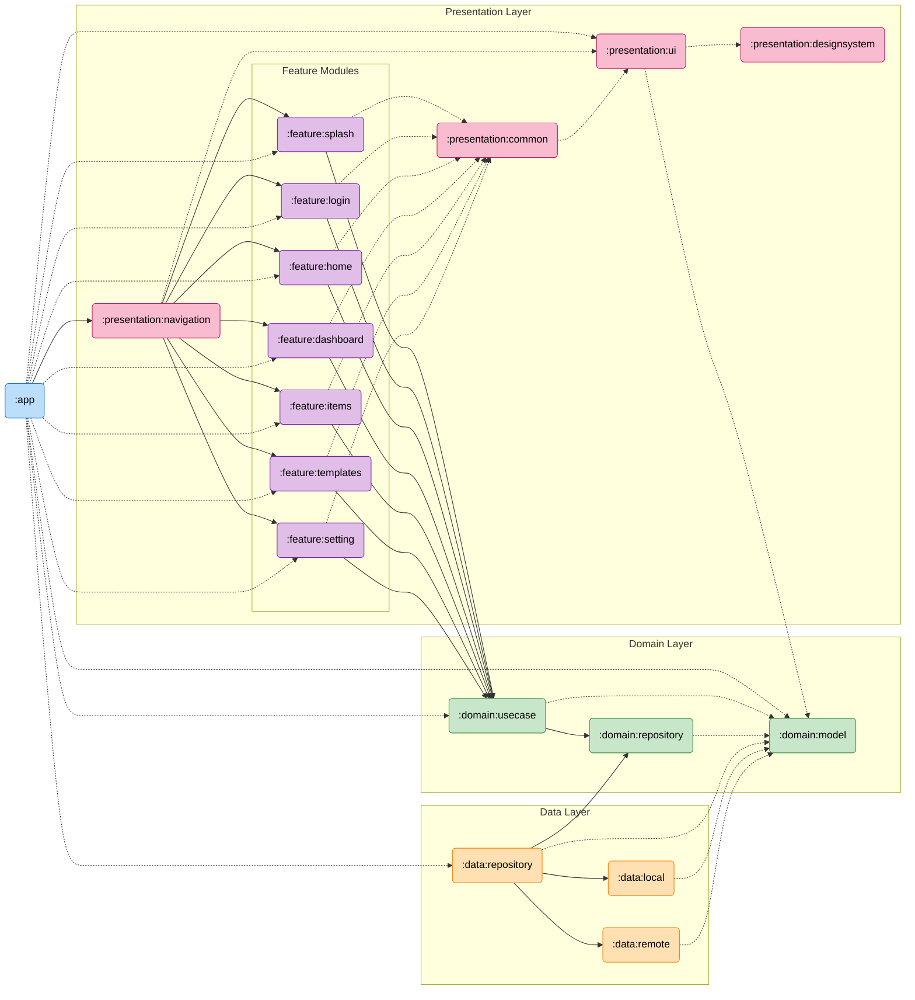

# CheckMate Architecture Documentation

CheckMate adopts a multi-module architecture based on Layered Architecture and MVVM/MVI patterns.

## Module Dependency Graph

## Module Descriptions

### App (`:app`)
The application entry point. It configures Dependency Injection (Koin), initializes the app, and launches the main activity.

### Presentation Layer
- **`:presentation:navigation`**: Handles the application's navigation graph and routing logic. It orchestrates transitions between different features.
- **`:presentation:feature:*`**: Contains the UI and logic for specific features (screens). Each feature module is independent and exposes an entry point for navigation.
- **`:presentation:ui`**: Contains reusable UI components, base classes (BaseViewModel, BaseFragment), and common UI utilities.
- **`:presentation:designsystem`**: Defines the design language (colors, typography, shapes, themes) and atomic UI components.
- **`:presentation:common`**: Shared logic and utilities specific to the presentation layer.

### Domain Layer
- **`:domain:usecase`**: Contains business logic encapsulated as Use Cases. It depends only on the Domain Model and Repository interfaces.
- **`:domain:model`**: Defines the core business objects and data structures used throughout the application. It has no dependencies on Android frameworks.
- **`:domain:repository`**: Defines the interfaces for data access (Repository pattern).

### Data Layer
- **`:data:repository`**: Implements the repository interfaces defined in the Domain layer. It coordinates data fetching from local and remote sources.
- **`:data:local`**: Handles local data storage (e.g., Room database, DataStore).
- **`:data:remote`**: Handles network communication (e.g., Retrofit, API calls).

