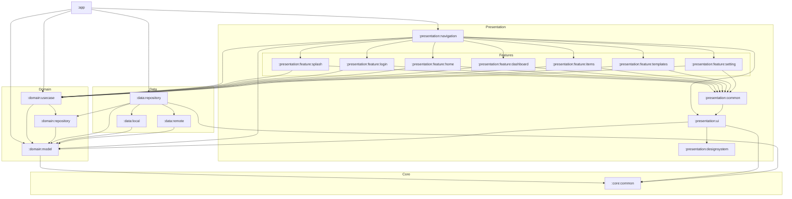

# アーキテクチャ概要

この文書では、CheckMate Android プロジェクトの高レベルな構造と主要モジュール間の相互作用について説明します。

## 階層化レイアウト

| レイヤー         | 目的                                                                                                                                                                                                            | 主要モジュール                                                                                                       |
|--------------|---------------------------------------------------------------------------------------------------------------------------------------------------------------------------------------------------------------|---------------------------------------------------------------------------------------------------------------|
| App          | すべてのレイヤーを統合し、DI とナビゲーションをホストするアプリケーションのエントリーポイント。                                                                                                                                                             | `app`                                                                                                         |
| Core         | ナビゲーションは `presentation:navigation` に移設され、共通の Kotlin API とビルドロジックのためのユーティリティを提供します。                                                                                                                            | `core:common`, `core:designsystem` (Compose テーマ用が `presentation:designsystem` に移動)                            |
| Domain       | ビジネスルールと契約。                                                                                                                                                                                                   | `domain:model`, `domain:repository`, `domain:usecase`                                                         |
| Data         | データソースとリポジトリの実装。                                                                                                                                                                                              | `data:remote`, `data:repository`, `data:local`                                                                |
| Presentation | Compose UI サーフェス。共通の UI ピースは `presentation:ui`、テーマは `presentation:designsystem`、ナビゲーションは `presentation:navigation` にあり、各機能は `presentation:feature:<name>` (ログイン、スプラッシュ、ホーム、設定、アイテム、ダッシュボード、テンプレート) の下に配置されます。 | `presentation:feature:*`, `presentation:ui`, `presentation:designsystem`, `presentation:navigation`, `widget` |

## 依存関係フロー

1. `app` は `core`、`domain`、`data`、`presentation` レイヤーおよび `widget` モジュールに依存します。
2. 各 `presentation:feature:*` モジュールは、ヘルパーとして `presentation:ui` を再利用し、テーマ、アイコン、およびその他の
   UI 契約のために共有の `presentation:designsystem` を使用します。
3. 機能モジュールは、必要に応じて `core`/`domain` レイヤーからナビゲーションおよびユースケースロジックにも依存します。
4. `data` モジュールは、`domain:usecase` によって消費されるリポジトリを実装し、最終的な機能はデータソースの知識を直接持つのではなく、ユースケースを要求します。

## 注意事項

- `presentation:designsystem` は、Compose テーマとトークンをプレゼンテーション階層内に保持するために
  `core` から移動されました。そのため、機能モジュールは直接 `presentation:designsystem` に依存するようになりました。
- ナビゲーションと共有 UI (ボタン、タイポグラフィなど) は `presentation:ui`
  の下に集中して残っているため、機能固有のモジュールは軽量のままにできます。
- 新しい機能が追加される場合は、構造を一貫させるために `presentation:feature:<name>` 規約に従い、
  `app/build.gradle.kts` を更新して新しい依存関係を含めてください。

## モジュール構成図

## レイヤー間の依存ルール

### 依存の方向性（上から下へ）

1. **App Layer** → すべてのレイヤーを統合
2. **Presentation Layer** → Domain Layer, Core Layer
3. **Domain Layer** → 他のレイヤーに依存しない（Pure Kotlin/Business Logic）
4. **Data Layer** → Domain Layer のインターフェースを実装
5. **Core Layer** → 全レイヤーから利用可能な共通ユーティリティ

### 各レイヤーの責務

#### App Layer

- アプリケーションのエントリーポイント
- 依存性注入（DI）の設定（Koin）
- ナビゲーショングラフの統合
- 各機能モジュールの組み立て

#### Presentation Layer

- **Feature Modules** (`presentation:feature:*`)
    - 各画面の UI ロジック（Compose UI）
    - ViewModel（MVI パターン）
    - 画面固有の状態管理
- **presentation:ui**
    - 共通の UI コンポーネント
    - 再利用可能な Composable 関数
- **presentation:designsystem**
    - テーマ定義（Color, Typography, Shape）
    - アイコン、スタイルガイド
- **widget**
    - Android ウィジェット実装

#### Domain Layer

- **domain:model**
    - ビジネスエンティティ（データクラス）
    - ドメインモデル
- **domain:repository**
    - リポジトリのインターフェース定義
    - Data Layer への抽象化
- **domain:usecase**
    - ビジネスロジックのユースケース
    - 単一責任の原則に基づく処理

#### Data Layer

- **data:repository**
    - `domain:repository` の実装
    - Remote と Local のデータソースを統合
- **data:remote**
    - API クライアント（Ktor, Retrofit など）
    - ネットワーク通信
- **data:local**
    - Room データベース
    - DataStore（設定値の永続化）

#### Core Layer

- **core:common**
    - 汎用的なユーティリティ
    - 拡張関数、ヘルパークラス
