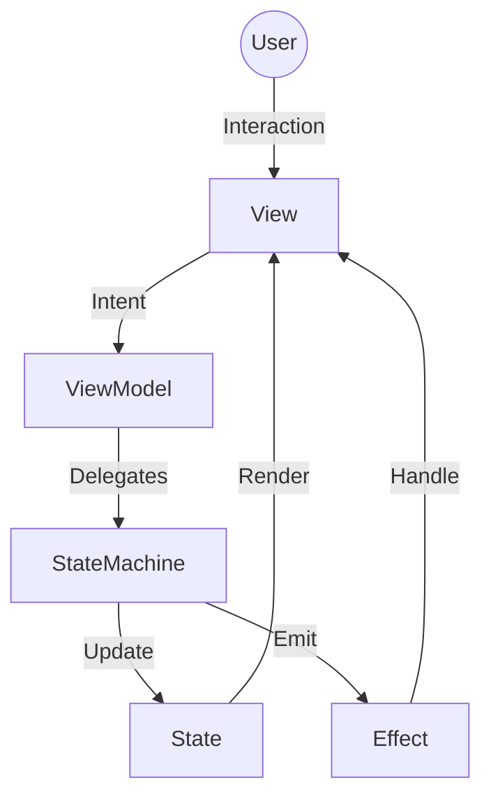

# CheckMate MVI 実装ガイドライン

このドキュメントは、CheckMate プロジェクトにおける **MVI (Model-View-Intent)** アーキテクチャの実装ルールを定義します。
UI と ViewModel 間の責務を明確にし、状態管理を統一することを目的としています。

## 1. アーキテクチャ概要

CheckMate では、以下の単方向データフロー (Unidirectional Data Flow) を採用しています。

1.  **Model (State)**: 画面の唯一の状態（Source of Truth）。
2.  **View (Composable)**: Model をレンダリングし、Intent を送信します。
3.  **Intent**: ユーザーのアクションやイベント。
4.  **Effect**: スナックバー表示など、ナビゲーション以外の「一度きりの副作用」。



---

## 2. コアコンポーネント

### 2.1 State (Model) & UiState
画面の状態はイミュータブルな `data class` として定義します。
読み込み状態やエラー状態を管理するため、この State を **`UiState<T>`** でラップします（LCE パターン）。

**重要: `UiState` は常にデータを保持します（Non-nullable）。**

-   **State**:
    ```kotlin
    data class DashboardState(
        val items: List<Item> = emptyList(),
        val currentRoute: NavKey = NavKey.List
    ) : MviState
    ```
-   **UiState**: `UiState<DashboardState>` (Idle / Loading / Success / Failure)

### 2.2 Intent
ユーザーが行うすべてのアクションを Intent として定義します。

```kotlin
sealed interface DashboardIntent : MviIntent {
    data object Refresh : DashboardIntent
    data class SelectItem(val id: String) : DashboardIntent
    data object Back : DashboardIntent
}
```

### 2.3 StateMachine
状態遷移と副作用の管理は `StateMachine` クラスに委譲されています。
`BaseViewModel` はこのクラスを内部で使用し、`execute` や `setState` などの操作を提供します。
`StateMachine` は `CancellationException` を適切にハンドリング（再スローまたは無視）し、構造化並行性を守ります。

---

## 3. 実装ガイドライン

### 3.1 ViewModel の実装
`BaseViewModel<I, S, E>` を継承します。
内部で `StateMachine` が使用されているため、開発者は `execute` や `setState` を呼ぶだけで適切な状態遷移が行われます。

#### 基本実装
```kotlin
class DashboardViewModel(
    private val repository: DashboardRepository
) : BaseViewModel<DashboardIntent, DashboardState, DashboardEffect>(DashboardState()) {

    override suspend fun handleIntent(intent: DashboardIntent) {
        when (intent) {
            is DashboardIntent.Refresh -> loadData()
            is DashboardIntent.SelectItem -> navigateToDetail(intent.id)
            is DashboardIntent.Back -> goBack()
        }
    }

    private fun loadData() {
        // execute() は Loading -> Success/Failure の遷移を自動で行います
        execute(
            action = { repository.getItems() },
            reducer = { items ->
                copy(items = items) // 'this' は現在の State
            }
        )
    }

    private fun navigateToDetail(id: String) {
        // ナビゲーションは State 更新
        setState {
            copy(currentRoute = NavKey.Detail(id))
        }
    }

    private fun goBack() {
        setState {
            copy(currentRoute = NavKey.List)
        }
    }
}
```

### 3.2 View (Composable) の実装
View は `uiState` (StateFlow<UiState<S>>) を監視し、状態に応じて UI を切り替えます。

```kotlin
@Composable
fun DashboardScreen(
    viewModel: DashboardViewModel = koinViewModel()
) {
    val uiState by viewModel.uiState.collectAsStateWithLifecycle()

    // Effect の処理
    LaunchedEffect(Unit) {
        viewModel.effect.collect { effect ->
            when (effect) {
                is DashboardEffect.ShowError -> { /* Snackbar 表示 */ }
            }
        }
    }

    // UiState のハンドリング
    val state = uiState
    
    // 常にデータを描画（Loading/Failure時もデータは保持されているため）
    DashboardContent(state.data, viewModel::sendIntent)

    // 状態に応じたオーバーレイ表示
    when (state) {
        is UiState.Loading -> {
            LoadingIndicator()
        }
        is UiState.Failure -> {
            ErrorBanner(state.message)
        }
        else -> {}
    }
}
```

---

## 4. 重要なルール

1.  **UiState Wrapper**: ViewModel は `StateFlow<UiState<S>>` を公開します。
2.  **Use execute()**: 非同期処理には `execute()` を使用して、Loading/Error 状態を自動管理してください。
3.  **Data Preservation**: `UiState` は Loading/Failure 時も `data` を保持します（Non-nullable）。UI 側ではこれを活用して、画面のチラつきを防いでください。
4.  **Send Effect**: Effect の送信には `sendEffect { ... }` (Builder パターン) を使用してください。
